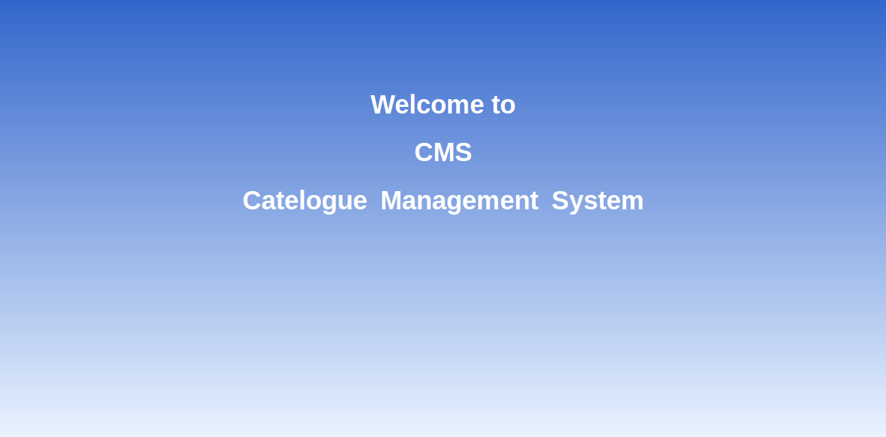
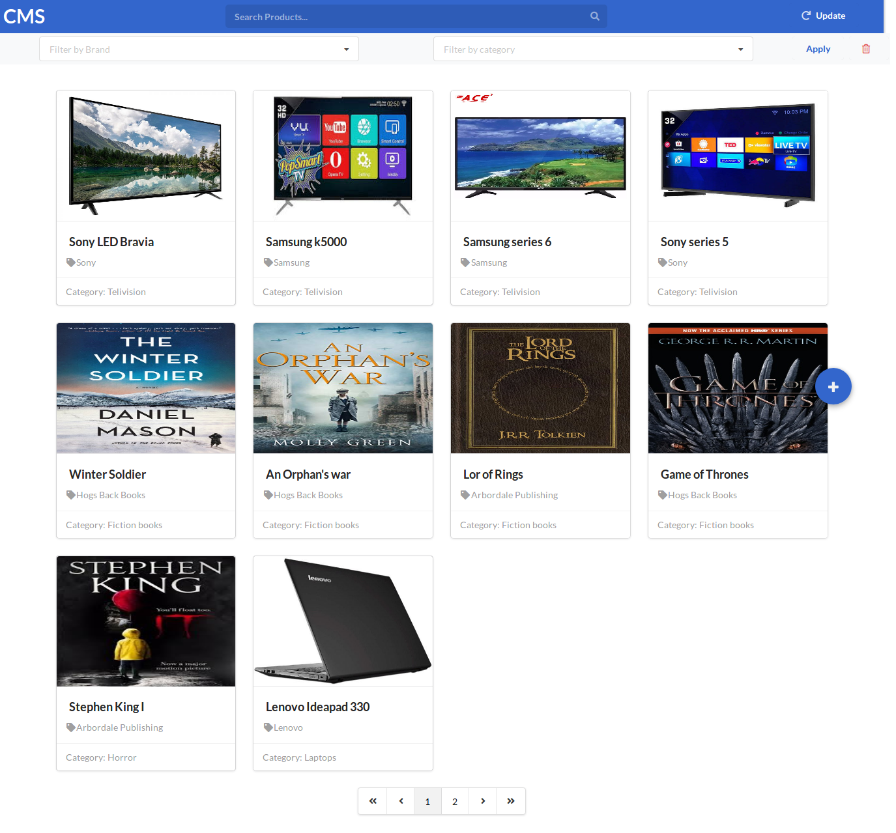
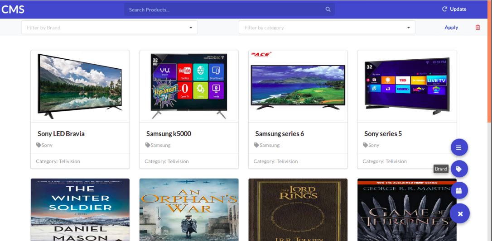
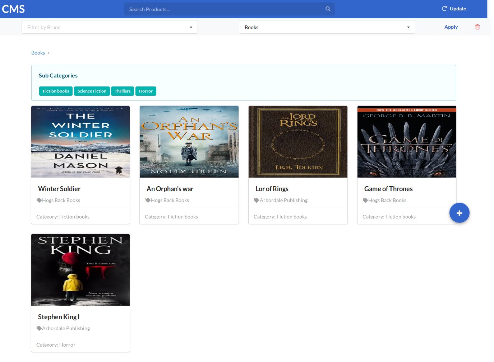
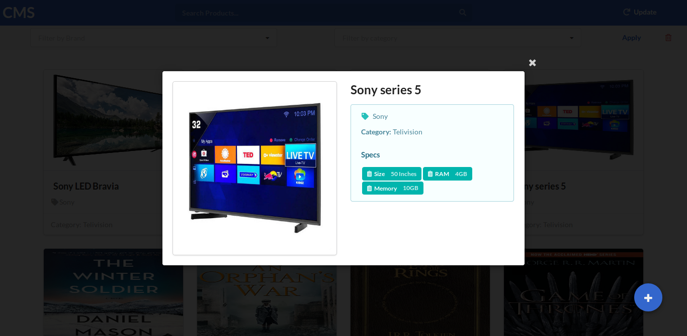
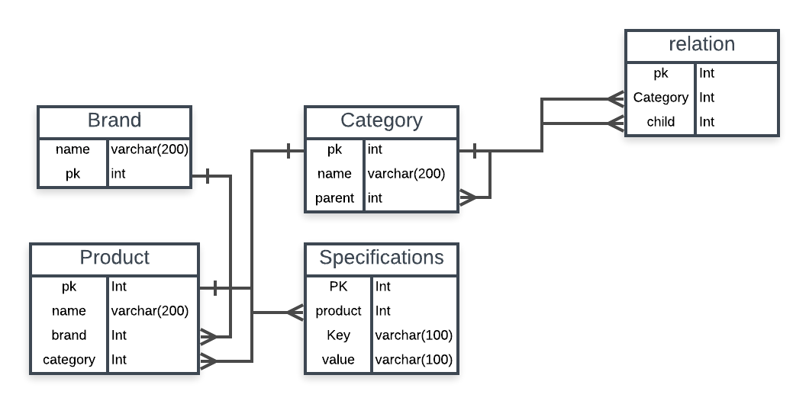

# Catalogue Management System

The tool is currently hosted at: http://aerchaincms.herokuapp.com/

## Intro and Usage

Catalogue Management System is a software where all the products can be showcased along with their corresponding brands, categories. All the products will be displayed in the form of list. The products are paginated. Presently, 10 products are being displayed for a page.

The products can be filtered. There are two filters
1. Filter by brand
2. Filter by Category

You can filter by either of brand or category or both. 

**Categories** form a tree data structure. Each **category** has a parent and **n** number of child nodes. Each node can be treated as a category. 
For example,

**Book** is a main category. **Fiction books**, **Adventure books** etc come under books. Each category can have some products. There is also an option to shift the node from one category to another. Suppose, you accidentally assigned **Mobiles** category under **Book**(instead of **Electronics**), you can reassign it under **Electronics**.

Initially, when you open the site, you will get a message like:



The above message is only displayed once (i.e when you open the website for the first time in a device). Now all the products will be displayed in below format:


**Note:** The above image is a full page screen-shot.

You can add **Brands**, **Products** and **Categories** using the **+** icon at the bottom right corner. On hovering icon, the following options will be displayed:



On selecting one of the options, a modal  will be displayed with the form to add the corresponding entity.

There is a search bar provided on the top. It searches for the provided name. 

Whenever you filter something through the category, a **breadcrumb** is displayed. Along with it, all the sub-categories in that category is displayed. Clicking on any such sub-category will update the filters and filter by the clicked sub-category. You can see them in the below image:



**Note:** The above image is a FULL page screen-shot.


You can also filter by brands. If there are total of 100 products, you filtered them according to a specific brand and category and got out 40 products. If you search something now, the server will query in the above 40 products only but not the entire 100 products. If you want to search over all the products, then you need to clear the filters.

On selecting a particular product in the list of products. Few more details of the product is displayed. It looks like:



**Color palatte:** 

## Database Architecture:

The following image displays the schema diagram of the project:


In the above diagram, all the brands are stored in **Brand** table. All the products are stored in **Product** table, all the categories are stored in **Categories** table.

As categories are in the form of a tree. Each node in the table has three entities 
1. pk
2. name of the category
3. reference to the parent.

i.e there is no relation formed between a parent and child directly. Each entity is linked to it's parent. There can be cases where the server has to return all the child nodes of a paticular node.

If the tree is small, BFS or DFS can be performed and all the nodes can be gathered. But if the tree is large and has millions of nodes, performing BFS or DFS can take more that ```O(n^2)``` in worst case.

So, another table named ```Relation``` is created. The table stores all the child's to a particular category. Using this table all the child nodes can be retrieved in a single query (fraction of seconds).

Finally, all the specifications of the product are stored in ```Specifications``` table.

## API Doc

Backend API documentation is available [here](https://documenter.getpostman.com/view/6222710/SVfRsTEB?version=latest).


